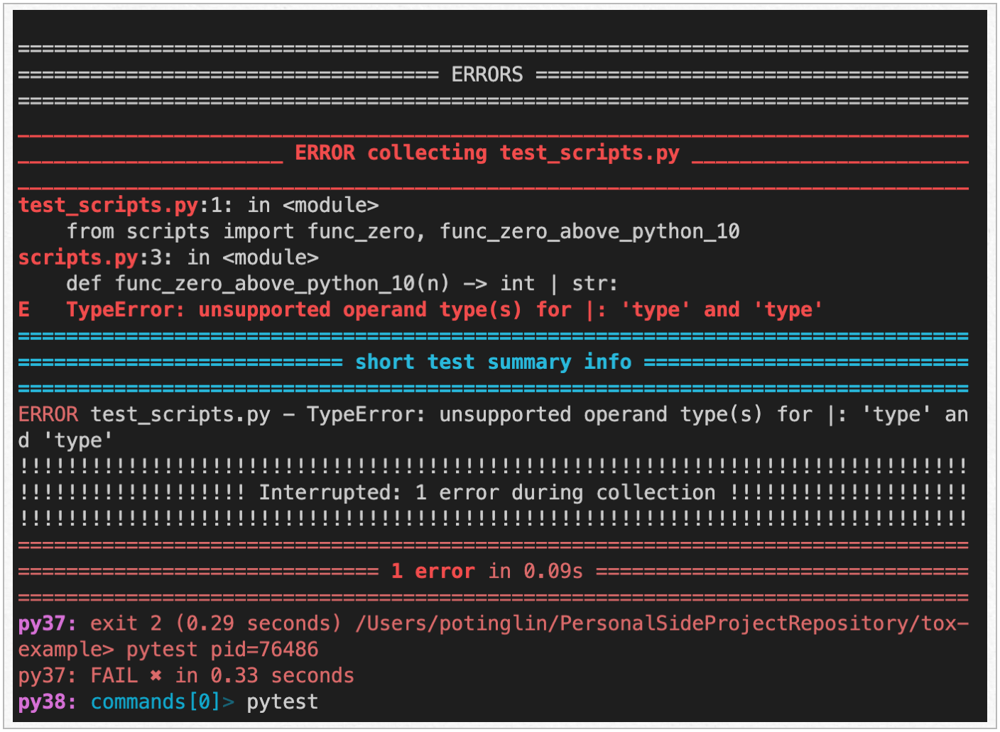
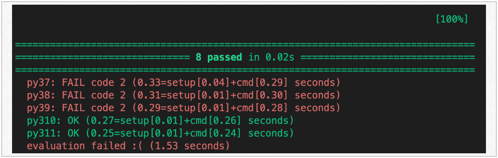

# Multiple-Version compatibility Check to Python Code (Tox example)
The Python project aims to test the compatibility of code with multiple Python versions using the tools tox, pyenv, and pytest.

### Use case
Test the Python script for compatibility with versions 3.7, 3.8, 3.9, 3.10, and 3.11.


### How to 
1. install tox in the global environment
```
pip install tox
```

2. install pytest in the global environment
```
pip install pytest
```

3. install python versions
```
pyenv install 3.7
pyenv install 3.8
pyenv install 3.9
pyenv install 3.10
pyenv install 3.11
```

4. run tox
```
tox run
```


### Result
Tox displays the issues in each file for each Python version:

 and then provides the most compatible Python versions at the end of the report.


